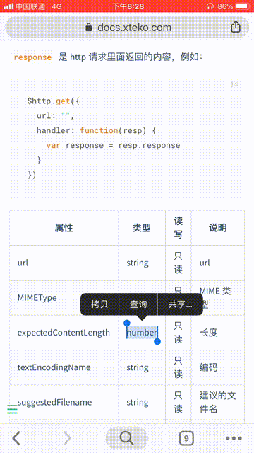

## CrazyTranslate

CrazyTranslate is a [JSBox](https://jsboxbbs.com) script for Google translation. It is light and fast, realizing the function of approximate delimit word translation.

It can display the English definitions, example sentences, and synonyms of the single English word, Helps you understand the meaning of the words better.

This is just a script based on my own needs, but I believe many people have the same needs.

> Use `translate.google.cn` for translation so support in mainland China.

### What can do

- Select text and share to JSBox for quick translation. `recommended`
- English definitions, example sentences, and synonyms are shown when translating a single English word.
- Copy the text and turn it through JSBox. `Switch the app`

### Running effect

 

### Thanks

[StackOverflowError](https://weibo.com/0x00eeee)'s [JSBox](https://jsboxbbs.com) platform.
